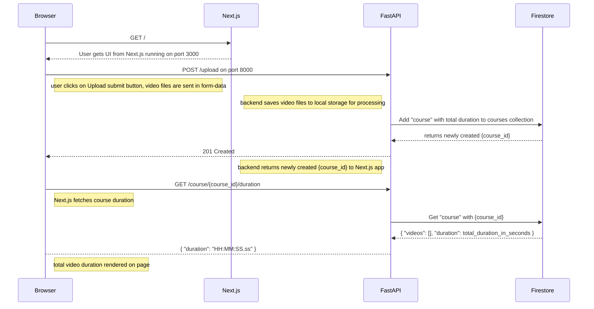

# Coding exercise: video duration
Upload 1+ videos and get the total duration of a "course"
- backend: **FastAPI**
- frontend: **Next.js**
- database: Google Cloud **Firestore**
- deployment: Docker Dompose on **Google Compute Engine**
- [online demo](http://104.196.209.243:3000/)

## How to run the demo locally
1. Set up upload directory for video uploads. Example:
   ```bash
   cd video-duration-api
   mkdir uploads
   echo "UPLOADS_DIR=uploads" >> .env
   ```
2. Set up CORS for Next.js client on FastAPI backend
   ```bash
   echo "ORIGINS=http://your_hostname:3000" >> .env
   ```
3. Set up Firestore authentication credentials
   You should have a functioning Firestore database on Google Cloud. Create a [service account key](https://cloud.google.com/iam/docs/keys-create-delete#iam-service-account-keys-create-console) and set up [authentication](https://cloud.google.com/firestore/docs/create-database-server-client-library#set_up_authentication):
   ```bash
   echo "GOOGLE_APPLICATION_CREDENTIALS=your-firestore-auth-key.json" >> .env
   ```
4. Set up Next.js public API URL
   This will tell Next.js where to find the FastAPI backend.
   ```bash
   cd ../video-duration-app
   echo "NEXT_PUBLIC_API_URL=http://your_hostname:8000" > .env
   ```
5. Create and run containers
   ```bash
   cd ..
   docker-compose up --build
   ```

## API endpoints
FastAPI endpoints on http://104.196.209.243:8000

### POST /upload
Upload 1+ video files for a "course"

Parameters: `files` 1+ video files as form-data on request body

Response status: 201 Created

Response body: `{ "course_id": [course_id] }`

### GET /course/{course_id}/duration
Query total duration for a course

Parameters: `course_id` on URL

Response: `{ "duration": "HH:MM:SS.ss" }`

[Example](http://104.196.209.243:8000/course/7gzOnqBWxHgSCLWXqI1Z/duration)

## Sequence diagram


