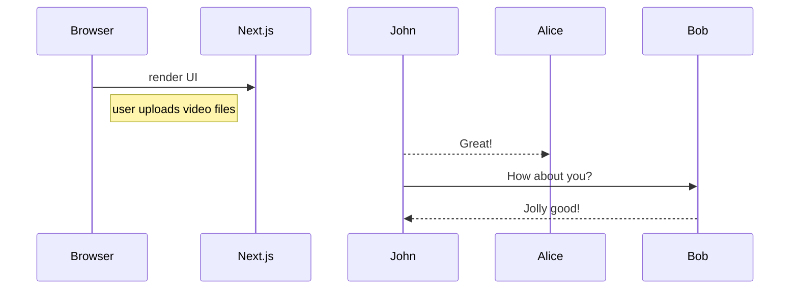

# Coding exercise: video duration
Upload 1+ videos and get the total duration of a "course"
- backend: FastAPI
- frontend: Next.js
- database: Google Cloud Firestore
- deployment: docker compose on Google Compute Engine
- [online demo](http://104.196.209.243:3000/)

## API endpoints
FastAPI endpoints on http://104.196.209.243:8000

### POST /upload
Upload 1+ video files for a "course"

Parameters: `files` 1+ video files as form-data on request body

Response status: 201 Created

Response body: `{ "course_id": [course_id] }`

### GET /course/{course_id}/duration
Query total duration for a course

Parameters: `course_id` on URL

Response: `{ "duration": "HH:MM:SS.ss" }`

[Example](http://104.196.209.243:8000/course/7gzOnqBWxHgSCLWXqI1Z/duration)

## Sequence diagram

